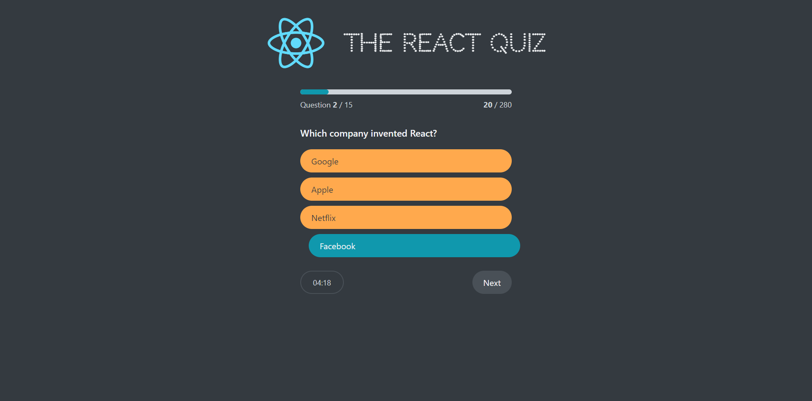

# React Quiz App

## Live Demo 🌐

Check out the live demo: [https://react-quiz-mo3bassias-projects.vercel.app](https://react-quiz-mo3bassias-projects.vercel.app)

## Project Description 📄

The React Quiz App is a comprehensive quiz application that fetches questions from an external API and allows users to test their knowledge. This project demonstrates advanced state management using `useReducer` and other React hooks.

## Features ✨

- **Dynamic Questions**: Fetch questions from an API.
- **State Management**: Advanced state management with `useReducer`.
- **Loading and Error Handling**: Displays loading spinner and error messages.
- **Interactive UI**: Provides an interactive user interface with immediate feedback.
- **Progress Tracking**: Tracks the user's progress throughout the quiz.
- **High Score Tracking**: Keeps track of the highest score achieved.

## Technologies and Libraries Used 🛠️

- **React ⚛️**: For building the user interface.
- **useReducer**: For managing complex state logic.
- **Fetch API 🌐**: For fetching questions from an external source.
- **CSS 🎨**: For styling the app.

## How it Works 🏃‍♂️

- The app starts in a "loading" state while fetching questions from the API.
- Upon successful data retrieval, the app moves to a "ready" state.
- Users can start the quiz, moving the app to an "active" state where questions are displayed.
- State is updated with each user interaction, such as answering questions or navigating through them.
- Upon quiz completion or timeout, the app transitions to a "finished" state displaying the results.

## Feedback and Contributions 🤝

I would greatly appreciate any feedback. Feel free to open issues or submit pull requests to improve this project.

---

**© 2024, Created by mo3bassia using React.**
